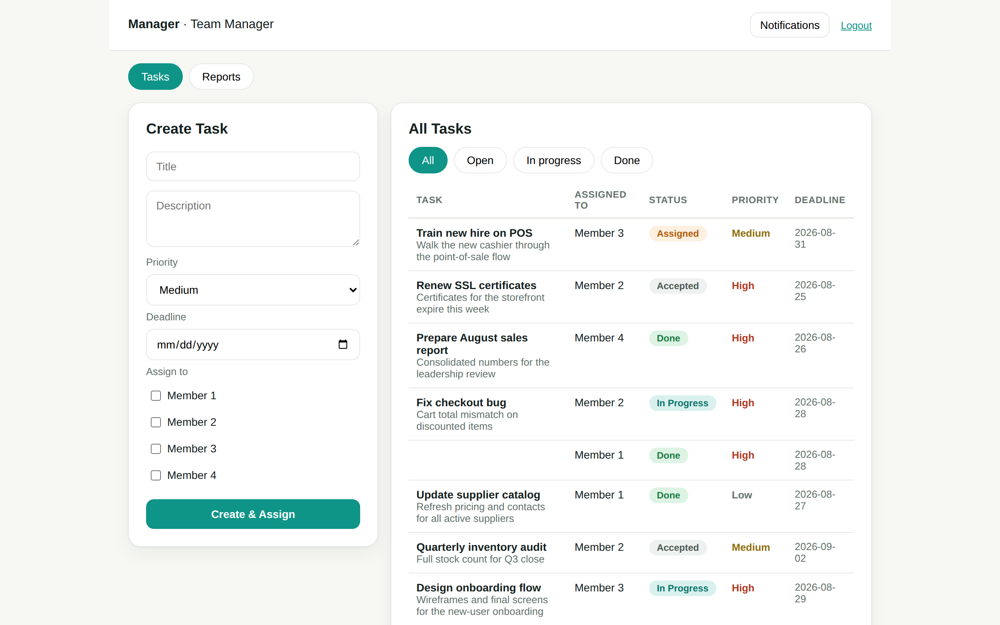
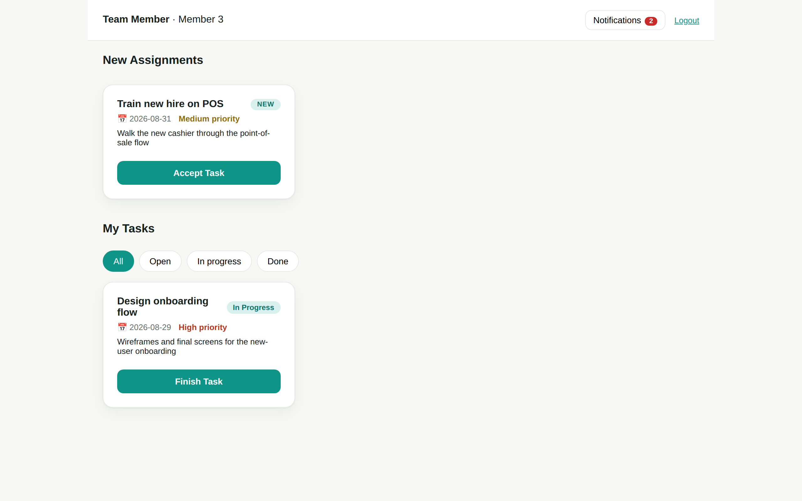
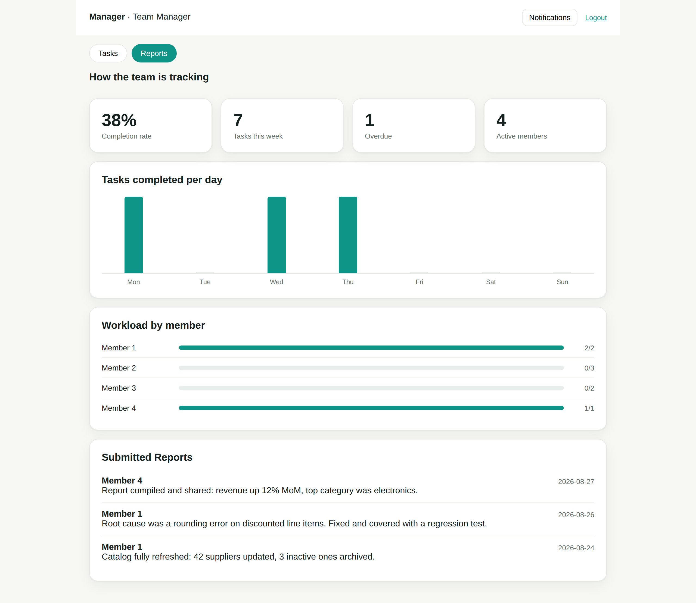

# Task Management System

A full-stack team task management app with a serverless Google Tasks integration — built end to end as a portfolio project: React + TypeScript frontend, FastAPI backend, PostgreSQL, JWT role-based auth, and a Python Cloud Run function that syncs assignments to Google Tasks via OAuth 2.0.



## The problem

Small teams coordinate work through chat messages and memory. Tasks get assigned verbally, progress is invisible until someone asks, completion is never recorded, and nothing reaches the tools people actually check during the day. Managers lack a single view of who is doing what; team members lack a clear queue of what they've committed to.

## The solution

A focused workflow app around one core loop:

**Manager assigns → member is notified → accepts → works → finishes → submits a report → manager reviews.**

- **Two roles, enforced server-side.** One manager account (seeded, never self-registered) and self-registered team members. Every request is authorized on the backend from a JWT — the UI's role selection is never trusted.
- **A strict task lifecycle.** `Assigned → Accepted → In Progress → Finished → Done` with per-assignee state: one task can go to several people, each with an independent status and completion report. Out-of-order transitions are rejected by the API.
- **In-app notifications.** Assignment writes a notification in the same transaction; clicking it jumps to the task, which must be explicitly accepted before it enters "My Tasks".
- **Manager analytics.** Completion rate, tasks this week, overdue count, tasks-completed-per-day, and per-member workload — computed server-side from the same relational data.
- **Google Tasks sync (serverless).** When a task is assigned, the backend calls a separately deployed Cloud Run function which creates the task in Google Tasks through the official SDK — so assignments appear on the assignee's phone, Gmail sidebar, and Calendar. The integration is feature-flagged and fail-silent: if the function is unreachable, assignment still succeeds.




## Architecture

```
React + Vite (TypeScript)
        │  HTTP + JWT
        ▼
FastAPI (Python) ── SQLAlchemy ──► PostgreSQL
        │
        │  POST /tasks + X-API-Key          (feature-flagged)
        ▼
Cloud Run function (Python) ── Google SDK + OAuth 2.0 ──► Google Tasks API
                                                              │
                                                              ▼
                                             phone · Gmail · Calendar (auto-sync)
```

The Google integration lives in its own repo/service with its own security (shared-secret header, OAuth refresh token held server-side, secrets in env vars — never in code). The database target is config-driven (`DATABASE_URL`), so the same code runs against local PostgreSQL or Cloud SQL.

## Stack

| Layer | Tech |
|---|---|
| Frontend | React 18, TypeScript, Vite, React Router |
| Backend | FastAPI, SQLAlchemy 2, Pydantic v2, python-jose (JWT), bcrypt |
| Database | PostgreSQL (pgAdmin for administration) |
| Serverless | Cloud Run functions, google-api-python-client, OAuth 2.0, Cloud Build + Artifact Registry |
| Testing | Automated API tests (22 checks) + browser end-to-end tests via Playwright (18 checks) |

## Running locally

```bash
# 1. Database — create role + db, or use docker compose up -d
#    (schema auto-creates on first backend start; see database/schema.sql)

# 2. Backend
cd backend
python -m venv .venv && .venv/Scripts/activate
pip install -r requirements.txt
# put DATABASE_URL, JWT_SECRET (and optional GTASKS_URL/GTASKS_API_KEY) in backend/.env
uvicorn app.main:app --reload        # api on :8000, docs at /docs

# 3. Frontend
cd frontend
npm install
npm run dev                          # app on :5173
```

Seeded manager: `manager@demo.com` / `manager123` (change in `.env`). Team members sign up in the app — their role is forced to `Employee` server-side.

## Security notes

- Passwords stored as bcrypt hashes only; JWT required on every protected route; roles and ownership re-checked server-side on each request.
- Employees can only read and act on their own assignments; reports are manager-only.
- All secrets live in environment files excluded from Git; the OAuth refresh token grants access to exactly one scope (tasks) and is revocable at any time.

## What building this taught me

- Diagnosing layered failures: a single "Failed to fetch" that turned out to be three stacked causes (an orphaned server process holding the port, CORS errors masking unhandled 500s, and a migration applied to the wrong database).
- OAuth 2.0 in practice: consent screens, refresh-token lifecycles (including the 7-day expiry for testing-status apps), and publishing requirements.
- Serverless operations: container builds failing on missing `requirements.txt` entries, IAM roles for build service accounts, reading Cloud Run logs.

## Roadmap

- Per-user Google account linking (web OAuth flow, per-user token storage)
- Event-driven notifications via Pub/Sub (`TaskAssigned` → independent consumers)
- Email verification and password reset
- Cloud deployment of the app itself (Cloud Run + Cloud SQL + Firebase Hosting)

## Related repo

[gtasks-api](https://github.com/Jumanaq-q/gtasks-api) — the serverless Google Tasks REST API this app integrates with.
